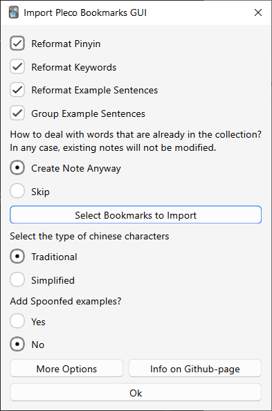
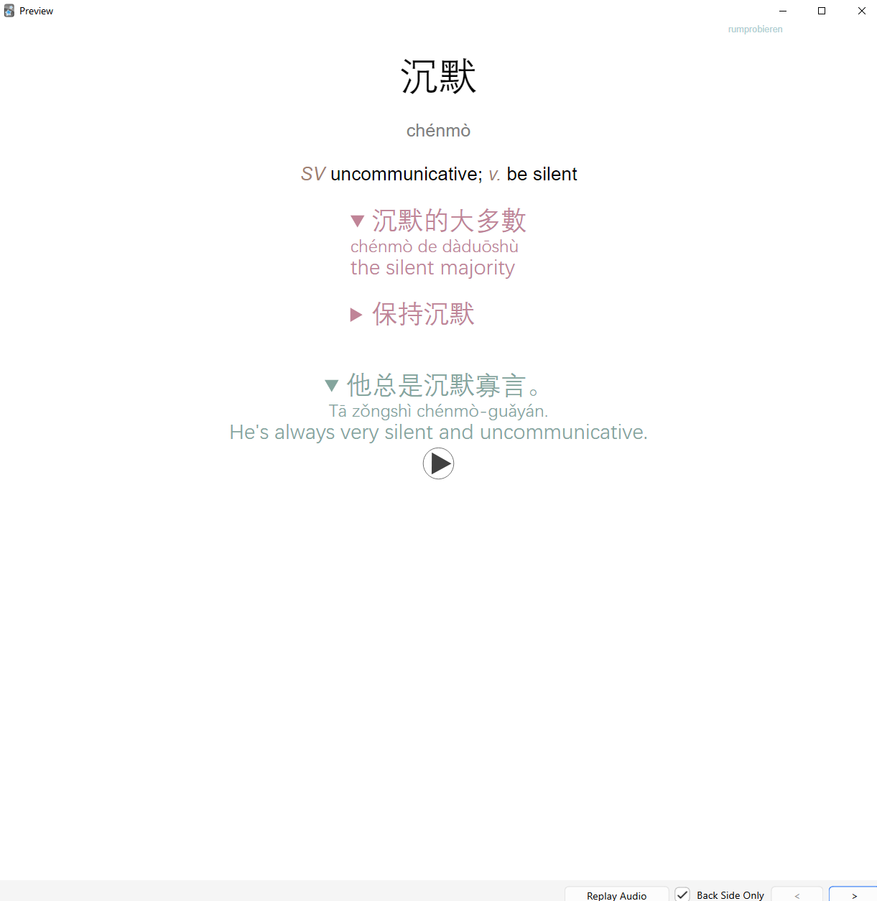
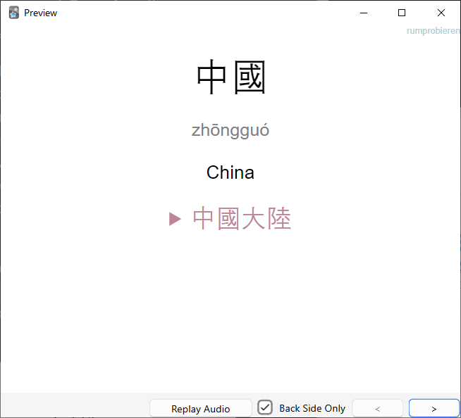
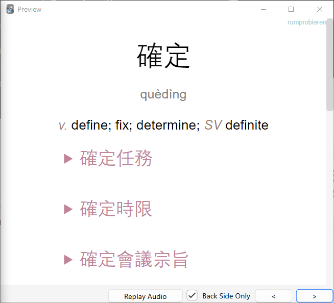

# Pleco-to-Anki

An [Anki](https://ankiweb.net/shared/info/427686509?cb=1695579432428) add-on for importing [Pleco](Pleco.com) bookmarks, enhancing the integration of two essential tools for learning Chinese. 
It streamlines flashcard creation by automatically transferring character info, pinyin, definitions, and examples from Pleco Bookmarks to Anki cards, with improved formatting. 
Optionally, it includes context-rich example sentences from [Spoonfed Chinese](https://promagma.gumroad.com/l/IEmpwF) for enhanced pronunciation practice.

# Quick Guide

1. Install the AddOn in Anki using the `427686509`\
   `Tools -> AddOns -> Get AddOns -> 427686509`
2. Export Pleco Bookmarks on your phone and save them on your computer. 
   Make sure to use these [settings](README_media/img_4.png).
3. Import the Bookmarks in Anki under `Tools -> Import Pleco Bookmarks`
4. Reformat the cards to your liking

# Table of Contents

   - [1. What this tool does](#1-what-this-tool-does)
     - [Example of a card being imported from Pleco to Anki](#11-example-of-a-card-being-imported-from-pleco-to-anki)
   - [2. Installation](#2-installation)
   - [3. Usage](#3-usage)
     - [Export Pleco Bookmarks in the Pleco app](#31-export-pleco-bookmarks-in-the-pleco-app)
     - [Import Pleco Bookmarks into Anki](#32-import-pleco-bookmarks-into-anki-using-this-addon)
     - [Reformat the cards to your liking](#33-reformat-the-cards-to-your-liking)
   - [4. Features](#4-features)
     - [Sort information into fields](#41-sort-information-into-fields)
     - [Format information](#42-format-information)
     - [Add Spoonfed sentences](#add-spoonfed-sentences)

# Documentation

## 1. What this tool does

The Pleco app allows for users to store bookmarks and to export these bookmarks to a textfile. This tool will parse the textfile and import the bookmarks into Anki. 
The bookmarks will be sorted into corresponding fields in Anki, such as the Chinese characters, pinyin, definition, and example sentences.

After importing the Bookmarks, one only has to give the cards a final touch in Anki to ones liking, for example by deleting redundantly much information, adding pictures, or changing the note type.

Since the information stored in Pleco bookmark is not well sorted, this tool does not work perfectly, sometimes the formatting of the information will be off or sorted in the wrong field. However, it still speeds up the process of building high quality anki cards, since it automates most of the work and adds some clever HTML formatting to the notes.

Additionally, this Add-On can add example sentences from [Spoonfed Chinese](https://promagma.gumroad.com/l/IEmpwF) to the Anki cards.
The add-on will add sentences from the Spoonfed Chinese anki deck that contain the word at hand to the card.
Since the Spoonfed decks contain thousands of sentences with audio files from native speakers, this is a great way to learn and practice chinese pronounciation from context.
In order for this feature to work, the Spoonfed anki deck need to be loaded in your Anki decks. The deck can be bought on the website of Spoonfed Chinese (https://promagma.gumroad.com/l/IEmpwF).

### 1.1. Example of a card being imported from Pleco to Anki

1) Bookmark in Pleco
2) Raw Data after exporting the Pleco Bookmarks
3) Card after importing the Pleco Bookmarks into Anki using this tool
4) Card after manually editing the card in Anki

## 2. Installation

Three options.

 - Download the latest release through Anki by using the `427686509` in the Anki AddOns menu: `Tools -> AddOns -> Get AddOns -> code`
 - Download the latest `pleco-to-anki.ankiaddon` file from [GitHub](https://www.github.com/vonpetersenn/pleco-to-anki) and install it by double-clicking or in Anki `Tools -> AddOns -> Install from file`
 - Download the source code and place the folder `pleco_to_anki` in the Anki AddOn folder, which, at least under Windows, is located at `.../AppData/Roaming/Anki2/addons21`'

If you want to use the Spoonfed Chinese feature, you need to have the Spoonfed Chinese anki deck loaded in your Anki collection. The deck can be bought on the website of Spoonfed Chinese (https://promagma.gumroad.com/l/IEmpwF).

## 3. Usage

### 3.1. Export Pleco Bookmarks in the Pleco app

1. In the pleco app got to `Import / Export` - `Export Bookmarks`

2. Make sure to match the `File Format`and `Include Data`options from the screenshot below. As for the `Character Set`, you can choose `traditional` or `simplified`.

Then `Begin Export`.

3. Go to the file manager and send the file to your computer, e.g. via Messenger, AirDrop, E-Mail etc.

### 3.2. Import Pleco Bookmarks into Anki using this AddOn

In Anki go to `Tools -> Import Pleco Bookmarks`. 
Select the file you just exported from Pleco and click `ok`. 
The options are set to the default values, which should work fine.
In general the options toggle some of the features described below.

### 3.3. Reformat the cards to your liking

Example of a card after importing the Pleco bookmarks. In red the example sentences from Pleco, in green the example sentences from Spoonfed Chinese.

View of the note in anki while editing. Either edit the note in the standard view or click on the button to the top right of each field to edit the HTML code directly.

Same card after manual editing.

## 4. Features

### Sort information into fields

The defintion with examples in pleco bookmarks are not sorted or seperated in any way. This tool tries to identify example sentences and sort them into a seperate field.

e.g. the definition of `中國` is 'China `中國大陸 zhōngguó dàlù Chinese mainland; mainland of China ....`
This string will be split into two fields:
definition: `China`
Example: `中國大陸 zhōngguó dàlù Chinese mainland; mainland of China ....`

This also works for words with multiple definitions and examples.

The tool creates notes with the fields `Chinese`, `Pinyin`, `Definition`, `Example` (and `Spoonfed` if the feature is turned on).

### Format information

#### Prettier Pinyin

Pleco bookmarks contain numerical pinyin (e.g. `ni3 hao3`). This tool converts the numerical pinyin to pinyin with tone marks (e.g. `nǐ hǎo`).
For this feature, we use a custom fork of the open source [tones](https://github.com/em-shea/tones) respository. 

#### Reformatting example sentences

HTML tags will be added to the example sentences to make them look nicer in Anki. 
Most importantly the pinyin and translation of an example sentence will be hidden behind the Chinese characters and only be shown when clicking on the Chinese characters. 
The motivation for this is to make it easier to practice reading Chinese characters and not to rely on the pinyin and translation too much.

For example, the example sentence `中國大陸 zhōngguó dàlù Chinese mainland; mainland of China` of the word `中國` after importing to Anki will look like this:

#### Reformat Keywords
Pleco notes can contain some keywords such as `verb`, `idiom`, `(TW)` etc. This tool will reformat these keywords to make them look nicer in Anki by replacing them and adding HTML tags for styling.

For example here 
the keywords verb and adjective are replaced by *v.* and *SV*.

The replacement of keywords can be customised by changing the keyword_replacements.py file in the config\pleco folder.

### Add Spoonfed sentences
If you have the [Spoonfed Chinese](https://promagma.gumroad.com/l/IEmpwF) anki deck loaded in your Anki decks, this tool can add example sentences from the Spoonfed Chinese anki deck to the Anki cards.
The tool adds up to 3 example sentences from the Spoonfed deck that contain the word at hand to the card.
The idea is, to chose the sentence that best fits the desired difficulty level and to delete the other sentences.
Then, everytime when reviewing the card, one can listen to the Spoonfed example sentence and try to repeat it.
Both traditional and simplified characters are supported, specify which one you want to use in the settings.
The number of cards can be changed in the settings.
The feature can be turned on
TODO: add example, add settings

In this example, 3 sentences contain the character 藏 but actually, the first and third sentences contain the compound word 收藏  instead of the single character verb 藏 which I want to learn. So I quickly delete the first and third sentence and keep the second one for my notes.  

# Contributing

